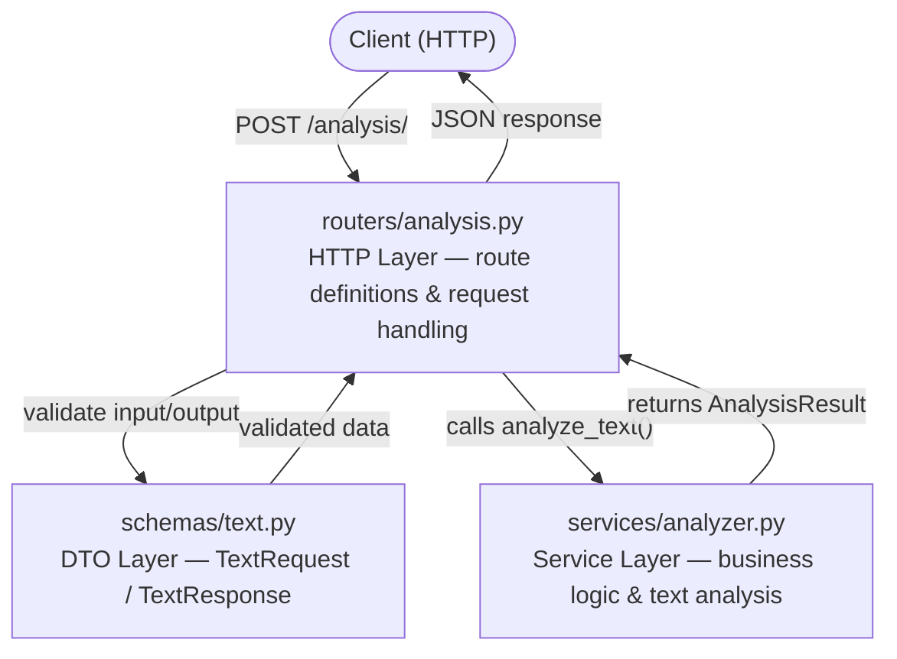

# Text Analyzer API

A REST API built with FastAPI that analyzes text and returns linguistic and statistical information such as language detection, word count, and character count.

---

## Endpoints

| Method | Route | Description |
|--------|-------|-------------|
| `GET` | `/health` | Health check |
| `POST` | `/analysis/` | Analyze text |

### POST `/analysis/`

**Request body:**
```json
{
  "text": "Hi, I'm good. How are you doing today?"
}
```

**Response:**
```json
{
  "text": "Hi, I'm good. How are you doing today?",
  "language": "en",
  "language_confidence": "99%",
  "character_count": 38,
  "word_count": 8
}
```

**Validation:**
- Text cannot be empty
- Text must have at least 10 characters

---

## Architecture

The project follows a **Layered Architecture** with clear separation of concerns:



**Design patterns applied:**
- **DTO (Data Transfer Objects):** Pydantic schemas (`TextRequest`, `TextResponse`) decouple input/output data from internal logic
- **Service Layer:** Business logic is isolated in `services/analyzer.py`, keeping routers thin
- **Layered Architecture:** Each layer has a single responsibility and depends only on the layer below it

**SOLID principles applied:**
- **S — Single Responsibility:** each file has one job: routers handle HTTP, services handle logic, schemas handle validation
- **O — Open/Closed:** new analysis features can be added as new services without modifying existing routes
- **I — Interface Segregation:** `TextRequest` and `TextResponse` expose only the fields each operation needs, nothing more
- **D — Dependency Inversion:** the router depends on the `analyze_text` function interface, not on implementation details of the analyzer

---

## Tech Stack

- **[FastAPI](https://fastapi.tiangolo.com/)** — web framework
- **[Uvicorn](https://www.uvicorn.org/)** — ASGI server
- **[Pydantic](https://docs.pydantic.dev/)** — data validation
- **[langdetect](https://github.com/Mimino666/langdetect)** — language detection
- **[Docker](https://www.docker.com/)** — containerization

---

## Run locally

**Requirements:** Docker Desktop

```bash
# Clone the repo
git clone https://github.com/DenilsonDonr/text-analyzer-api.git
cd text-analyzer-api

# Build and run
docker-compose up --build
```

API available at `http://localhost:8000`

### Without Docker

```bash
python -m venv venv
venv\Scripts\activate       # Windows
pip install -r requirements.txt
uvicorn app.main:app --reload
```

---

## Run tests

```bash
python -m pytest
```
